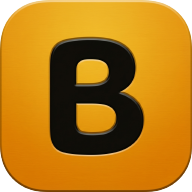
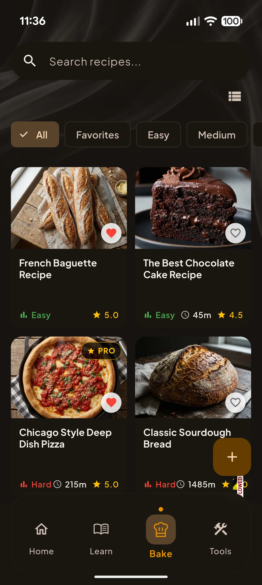
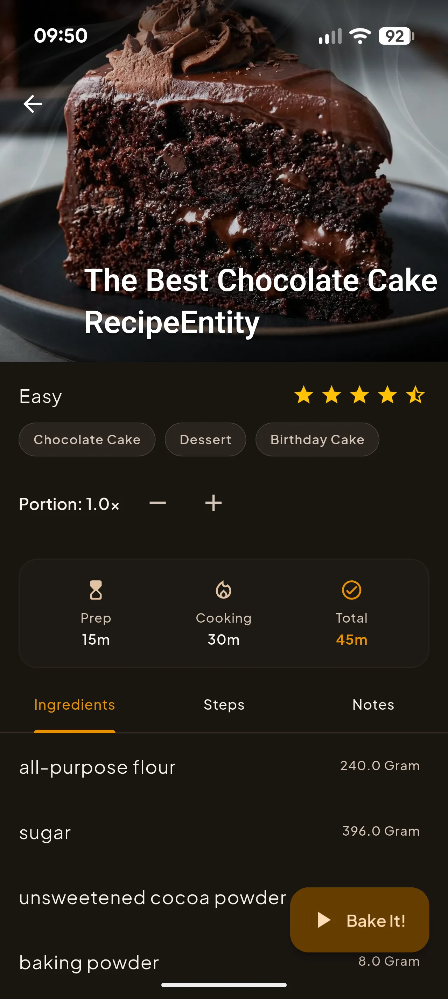
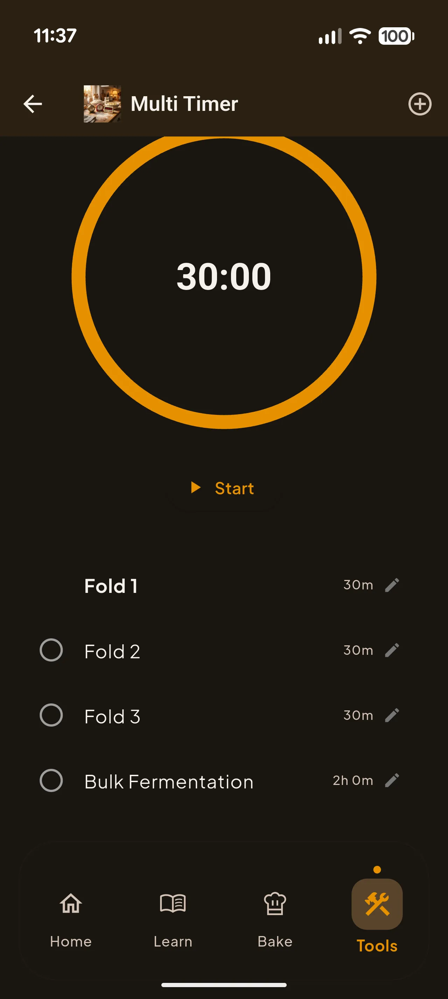
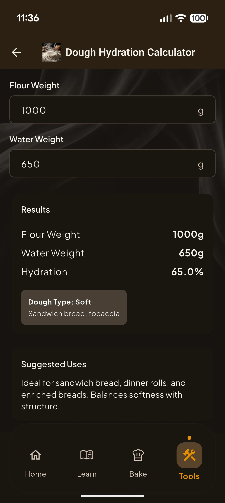

  

<h1 align="center">The Baker 🥖</h1>

  <strong>Your personal baking companion</strong> 
  Master baking with guided recipes, precise timers & handy calculators.

  

  
  
  

---

## What is The Baker?

The Baker is your personal baking companion, designed to help you create perfect bread, pastries, and more every time. Whether you're a beginner learning sourdough or an experienced baker scaling recipes, The Baker has the tools you need.

---

## 📱 Screenshots

  
  &nbsp;&nbsp;
  
  &nbsp;&nbsp;
  
  &nbsp;&nbsp;
  

---

## ✨ Features

### 📖 Guided Recipes
Follow step-by-step instructions for bread, sourdough, pizza dough, and pastries. Each recipe is broken down into clear stages with timers attached.

### ⏱️ Multi-Step Timers
Never miss a proofing or baking step. Set multiple timers and get notified exactly when it's time to move on. Perfect for complex bakes.

### 🔢 Baking Calculators
Calculate hydration, scale recipes up or down, and convert ingredients with ease. Tools designed by bakers, for bakers.

### 🌙 Beautiful Design
- Clean, distraction-free interface
- Offline access to your saved recipes
- Personalized notes on each recipe
- Dark mode for late-night prep

---

## 📥 Download

  

---

## 🔒 Privacy

The Baker is designed with privacy in mind. Most of your data is stored **locally on your device** — we don't have access to it.

- [Privacy Policy](https://indiedesert.github.io/the-baker/web/privacy-policy.html)
- [Data Deletion Guide](https://indiedesert.github.io/the-baker/web/data-deletion-guide.html)

---

## 📬 Contact

Have questions or feedback? Reach out to us:

📧 **Email:** [support@indiedesert.com](mailto:support@indiedesert.com)

---

  © 2026 The Baker. All rights reserved.

